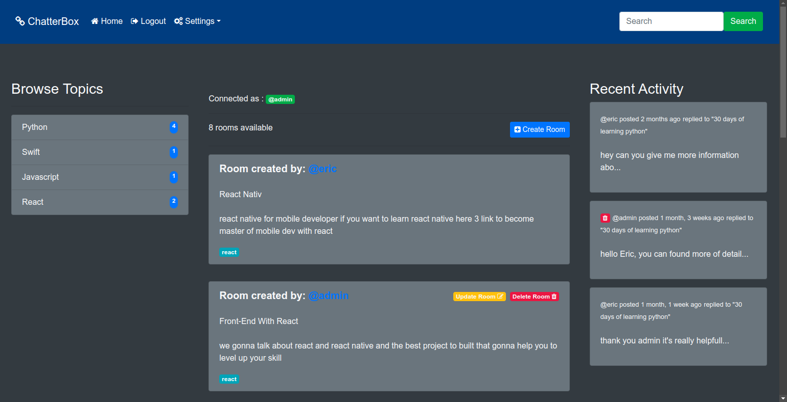
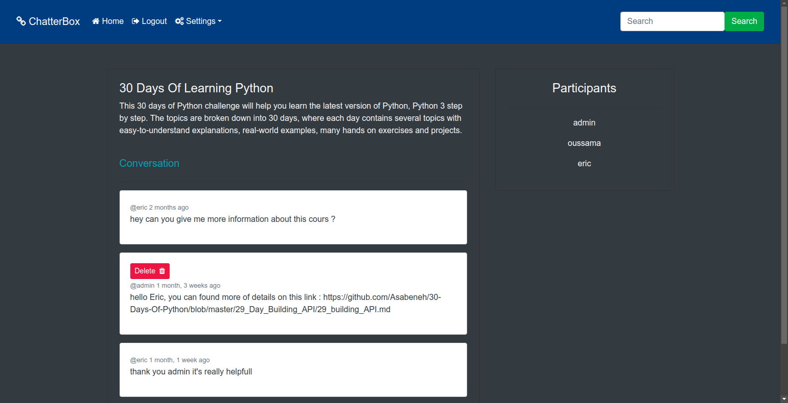

# Chatterbox - A Django Chatroom Application
Chatterbox is a chatroom application built with Django that allows users to create, join, and participate in discussions within specific topic-based rooms. The frontend is styled using Bootstrap, providing a clean, responsive, and modern interface. Users can browse rooms, post messages, and manage their own rooms, all while maintaining a user-friendly experience.

## Features
Searchable Rooms: Users can search rooms by topics, names, descriptions, or hosts.
Room Management: Authenticated users can create, update, and delete chat rooms.
Message Posting: Users can post messages in rooms and see live discussions.
Profile Pages: View rooms and topics associated with a user.
Authentication: Secure user authentication, login, and signup functionality.
Bootstrap Integration: Responsive design and layout for both desktop and mobile devices.
Admin Interface: Manage users, rooms, and topics through Django’s admin panel.

## Technologies Used
Backend: Django
Frontend: HTML, CSS (with Bootstrap for responsive design)
Database: SQLite (default, can be swapped for other databases)
Authentication: Django's built-in user authentication system

## Installation and Setup
Follow these steps to set up the project locally on your machine.

### Prerequisites
####Python 3
####Django

### Steps
Clone the repository:
```bash
git clone https://github.com/yourusername/chatterbox.git
cd chatterbox
```
### Create and activate a virtual environment:

```bash
python -m venv env
source env/bin/activate  # On Windows use `env\Scripts\activate`
```
### Install dependencies:

Install required Python packages using pip:

```bash
pip install -r requirements.txt
```
## Screenshots
### register page

### sign up page

### home page

### user profile

### room's conversations ( specific topic )

